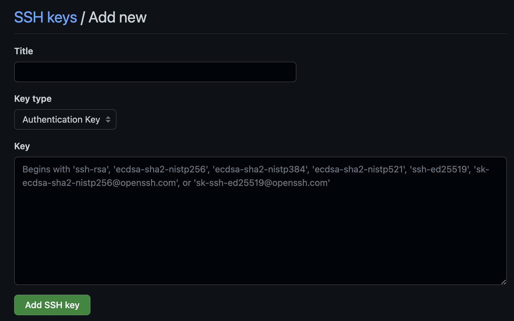

# Git

[](../../assets/git/git_logo.png)


## 📘 Documentation
https://git-scm.com/doc

---

## ⚙️ Installation
### On mac
```bash
brew install git
```
### On Ubuntu

```bash
sudo apt install git-all
```
### On Windows

```bash
choco install git
```

---
## 🔑 Multiple accounts

### Create your multiple ssh key
Give a specific key file for each scope.
Ex. 
- /Users/\<your-home\>/.ssh/id_rsa_work1
- /Users/\<your-home\>/.ssh/id_rsa_work2
- /Users/\<your-home\>/.ssh/id_rsa_private
```bash
ssh-keygen
```
### Add the keys to the ssh-agent
```bash
ssh-add /Users/<your-home>/.ssh/id_rsa_work1
ssh-add /Users/<your-home>/.ssh/id_rsa_work2
ssh-add /Users/<your-home>/.ssh/id_rsa_private
```
### Copy the public key to your SSH settings on GitHub/GitLab
1. In the upper-right corner of GitHub/GitLab, click your profile photo, then click Settings/Preferences

[](../../assets/git/git_01.png)

2. Click SSH and GPG keys

[](../../assets/git/git_02.png)

3. Copy the output of the following command and paste it in the Key field
```bash
cat ~/.ssh/id_rsa_work1.pub
```

[](../../assets/git/git_03.png)

4. Execute the same steps for the other keys/Git versione control tools

### Create the ~/.ssh/config file
 ```bash
cd ~/.ssh
vim config
 ```

Paste the following test, but first edit it where necessary:
```bash
# Personal GitHub account
Host github.com-private
HostName github.com
User git
AddKeysToAgent yes
UseKeychain yes
IdentityFile ~/.ssh/id_rsa_private

# Work 1 GitHub account
Host github.com-work1
HostName github.com
User git
AddKeysToAgent yes
UseKeychain yes
IdentityFile ~/.ssh/id_rsa_work1

# Work2 2 GitHub account
Host github.com-work2
HostName github.com
User git
AddKeysToAgent yes
UseKeychain yes
IdentityFile ~/.ssh/id_rsa_work2
```

### Clone the repo with a modified URL
Pattern:

```bash
git clone git@github.com-private:<repo-path>.git
```

Example:
```bash
git clone git@github.com-private:floppino/studies.git 
```

### Or change the URL it in the repo .git/config file
Modify the `url` parameter and insert the one used above:

```bash
cd studies # Enter the repository root folder
git config remote."origin".url "git@github.com-private:floppino/studies.git"
cat .git/config
```

[](../../assets/git/git_04.png)

### Configure the user's info
```bash
git config user.name "<github-username-or-fullname>"
git config user.email "<github-account-email>"
```
Repeat these last three steps for all repositories.

### Original Guide
https://www.heady.io/blog/how-to-manage-multiple-github-accounts

---