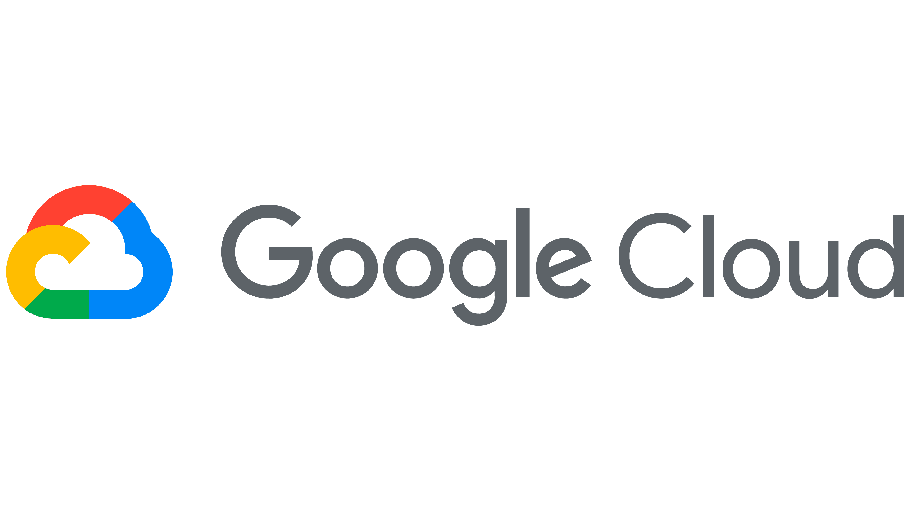

# Google Cloud Platform - GCP


[](../../assets/gcp/gcp_logo.png)

## 📘 Documentation
https://cloud.google.com/#/docs/

---

## ⚙️ SDK Installation
### On MacOS
```bash
brew install --cask google-cloud-sdk 
```

### On Ubuntu
```bash
sudo apt update  
sudo apt install google-cloud-sdk
```
### On Windows
```powershell
(New-Object Net.WebClient).DownloadFile("https://dl.google.com/dl/cloudsdk/channels/rapid/GoogleCloudSDKInstaller.exe", "$env:Temp\GoogleCloudSDKInstaller.exe")
& $env:Temp\GoogleCloudSDKInstaller.exe 
```

### Official installation guide
https://cloud.google.com/sdk/docs/install

---

## 📚 Courses

### DevOps

1. Google Webinar (GCP introduction):
    - free
    - 4 videos
    - https://cloudonair.withgoogle.com/events/onboard-google-cloud-fundamentals
2. Google course:
    - 1 month free
    - generic, long but light, with labs)
    - https://www.cloudskillsboost.google/paths/20
3. Book "Google Cloud for DevOps Engineers"


---

## ⏯️ Tutorials


---

## ⏱️ Quickstart Guide


--- 

## 📖 Quiz

- https://www.exam-answer.com/google/pcde/question55
- https://www.freecram.net/exam/Professional-Cloud-DevOps-Engineer-google-cloud-certified-professional-cloud-devops-engineer-exam-e12268.html
(Suggested links 1, 3 and 4)
- https://www.examtopics.com/exams/google/professional-cloud-devops-engineer/view/1/
    - For more questions go to https://www.examtopics.com/discussions/google/1/ and look for 'floppino'

---

## 🎓 Certifications

https://webassessor.com/googlecloud

---

## 🎬 Videos


---

## 🌵 GitHub
