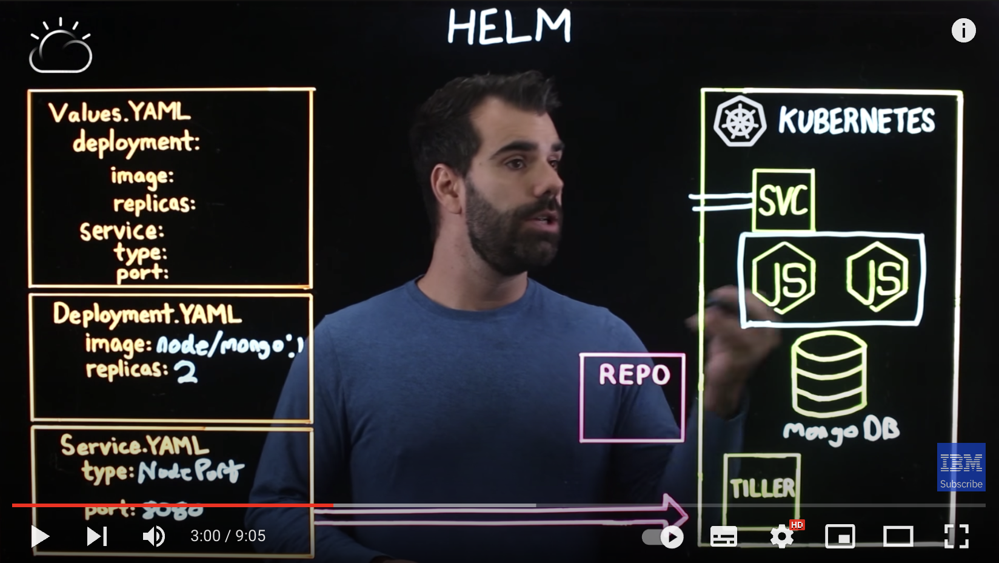
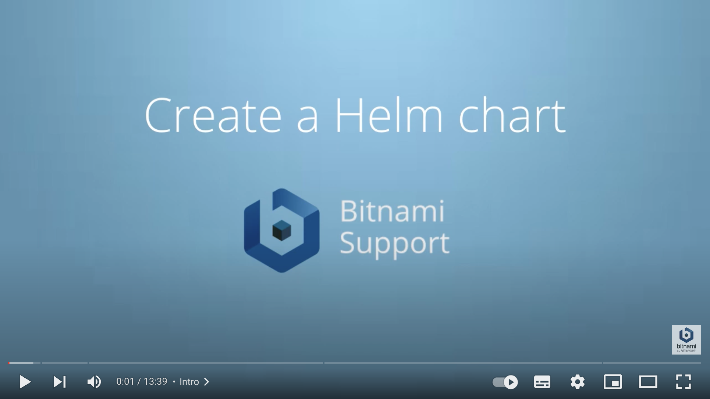

# Helm


[](../../assets/helm/helm_logo.png)

## 📘 Documentation
https://helm.sh/docs/

---

## ⚙️ Installation

### From script
```bash
curl -fsSL -o get_helm.sh https://raw.githubusercontent.com/helm/helm/main/scripts/get-helm-3
chmod 700 get_helm.sh
./get_helm.sh
```

### Throught Package Managers
#### Mac
```bash
brew install helm
```
#### Windows
```bash
choco install kubernetes-helm
```
#### Ubuntu
```bash
curl https://baltocdn.com/helm/signing.asc | gpg --dearmor | sudo tee /usr/share/keyrings/helm.gpg > /dev/null
sudo apt-get install apt-transport-https --yes
echo "deb [arch=$(dpkg --print-architecture) signed-by=/usr/share/keyrings/helm.gpg] https://baltocdn.com/helm/stable/debian/ all main" | sudo tee /etc/apt/sources.list.d/helm-stable-debian.list
sudo apt-get update
sudo apt-get install helm
```
### Official installation guide
https://helm.sh/docs/intro/install/

---

## ⏯️ Tutorials
1. https://devopscube.com/create-helm-chart/
2. https://www.containiq.com/post/helm-charts

---

## ⏱️ Quickstart Guide
https://helm.sh/docs/intro/quickstart/

---

## 🎬 Videos
Basic explanation:

[](https://www.youtube.com/watch?v=fy8SHvNZGeE "Helm tutorial")

Tutorial:

[](https://www.youtube.com/watch?v=TJ9hPLn0oAs "Helm tutorial")

---

## 🌵 GitHub
https://github.com/helm/helm