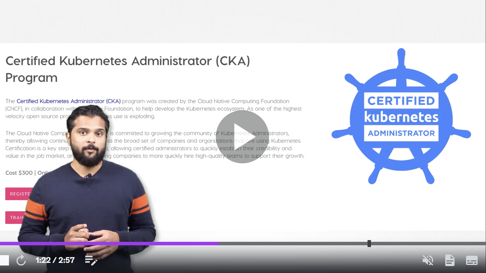
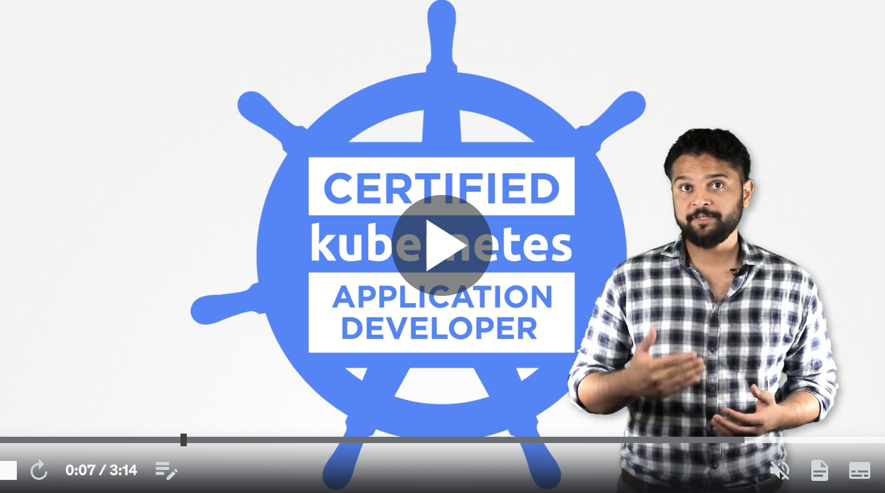
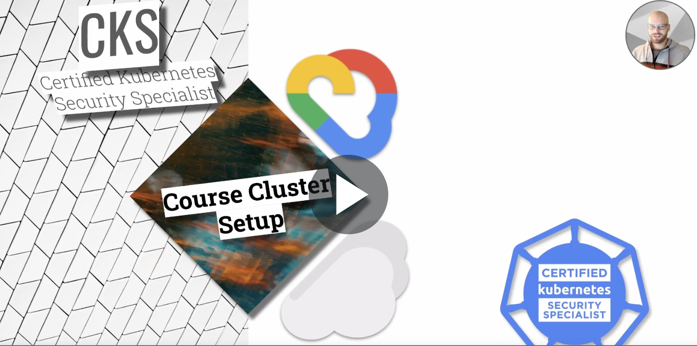

# Kubernetes


[](../../assets/k8s/k8s_logo.png)

## 📘 Documentation
https://kubernetes.io/docs/home/

---

## ⚙️ Installation
### On Mac
```bash
brew install kubectl
```
### On Ubuntu
```bash
sudo apt-get update
sudo apt-get install -y ca-certificates curl
sudo curl -fsSLo /etc/apt/keyrings/kubernetes-archive-keyring.gpg https://packages.cloud.google.com/apt/doc/apt-key.gpg
echo "deb [signed-by=/etc/apt/keyrings/kubernetes-archive-keyring.gpg] https://apt.kubernetes.io/ kubernetes-xenial main" | sudo tee /etc/apt/sources.list.d/kubernetes.list
sudo apt-get update
sudo apt-get install -y kubectl
```

### On Windows
```bash
choco install kubernetes-cli
```

Check the installation:
```bash
kubectl version --client
```

### Official installation guide
https://kubernetes.io/releases/download/

---

## 📚 Courses

CKA

[](https://www.udemy.com/course/certified-kubernetes-administrator-with-practice-tests/ "Udemy - CKA course")

CKAD

[](https://www.udemy.com/course/certified-kubernetes-application-developer/ "Udemy - CKAD course")

CKS

[](https://www.udemy.com/course/certified-kubernetes-security-specialist/ "Udemy - CKS course")

---

## 🎯 Labs
KodeKloud

- https://kodekloud.com/

CKA

- https://kodekloud.com/courses/labs-certified-kubernetes-administrator-with-practice-tests/


CKAD

- https://kodekloud.com/courses/labs-certified-kubernetes-application-developer/

CKS

- https://killercoda.com/killer-shell-cks/

Game of Pods

- https://kodekloud.com/courses/kubernetes-challenges/

---

## ⏯️ Tutorials

- [Kubernetes Basics](https://kubernetes.io/docs/tutorials/kubernetes-basics/)
- [Introduction to Kubernetes](https://www.edx.org/course/introduction-to-kubernetes)
- [Hello Minikube](https://kubernetes.io/docs/tutorials/hello-minikube/)
- [Kubernetes Docs Tutorials](https://kubernetes.io/docs/tutorials/)
---

## ⏱️ Quickstart Guide


--- 

## 🎬 Videos


---

## 🌵 GitHub
https://github.com/kubernetes/kubernetes

---

## 🎓 Certifications

https://trainingportal.linuxfoundation.org/